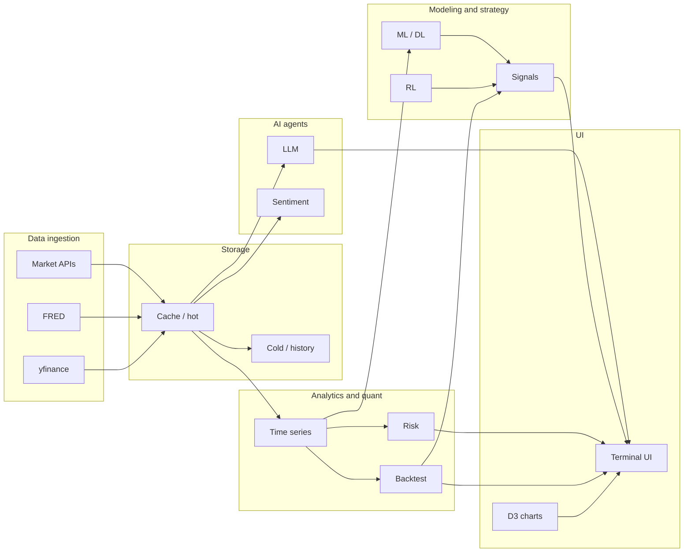

# Financial Analysis Terminal – Architecture

## High-level architecture

- **Data ingestion**: Market data (yfinance, Alpha Vantage when configured), FRED for macro. All exposed via a unified data layer (`core/data_fetcher.py`, `api/data_api.py`).
- **Storage**: Hot path uses in-memory/cache; cold/historical can use files or DB (config-driven). Target: point-in-time correctness, survivorship-free and versioned datasets.
- **Analytics and quant**: Time-series and cross-sectional analysis, risk (VaR, stress, drawdown), backtesting with slippage, transaction costs, and market impact (`core/backtesting.py`, `core/institutional_backtesting.py`).
- **Modeling and strategy**: ML/DL/RL models produce signals; backtesting consumes the same signal interface. API-first: all capabilities are callable via REST/WebSocket.
- **AI agents**: LLM and sentiment services consume cached data and expose analysis and natural-language interfaces to the terminal.
- **UI**: Bloomberg-style terminal (React/TypeScript) with D3.js charts, command bar (Bloomberg-like function codes), multi-panel layout, and keyboard-first interaction.

## Tech stack justification

| Layer | Choice | Rationale |
|-------|--------|-----------|
| **Frontend** | React, TypeScript, Vite | Strong typing, fast dev loop, standard ecosystem for terminal UIs. |
| **Charts** | D3.js | Required for institutional-grade, interactive, high-density charts (candlesticks, volume, zoom/pan, future indicators and drawing tools). |
| **Styling** | CSS variables, no framework | Bloomberg-inspired dark theme, monospace for numbers, minimal dependency. |
| **Backend** | Python, FastAPI | Async-ready, OpenAPI, good fit for quant/ML and data pipelines. |
| **Data** | yfinance, Alpha Vantage, FRED | Broad coverage for equities and macro; unified via `DataFetcher` and optional `source` params (e.g. sample-data). |
| **Quant** | NumPy, pandas, custom engines | Backtesting and risk are in-house with explicit slippage, costs, and market impact; no “toy” assumptions. |
| **AI/ML** | scikit-learn, PyTorch/TF, LLM APIs | ML pipelines, DL for time-series, RL for strategies; LLM for natural-language and explanations. |
| **Real-time** | WebSocket | Live prices and streaming to the terminal. |
| **Deploy** | Docker, optional K8s | Single compose for local dev; production scaling via existing docs. |

## Config

- **Central config**: `config/settings.py` and `config/__init__.py` expose `get_settings()` with typed `DataSettings`, `BacktestSettings`, `AISettings`. All values are loaded from environment variables (via `.env`); optional overrides from `config/config.py` if present. No magic numbers: `BACKTEST_USE_INSTITUTIONAL_DEFAULT`, `SAMPLE_DATA_SOURCE`, API keys (FRED, Alpha Vantage, OpenAI) are config-driven. Backtesting API and data layer use these settings for defaults.

## Data layer

- **Target standards**: Point-in-time correctness, survivorship-bias-free datasets, versioned datasets, reproducible research state. Unified schemas across asset classes; hot (cached) vs cold (historical) separation.
- **Current**: `core/data_fetcher.py` unifies yfinance, FRED, and Alpha Vantage (when configured); API keys read from config when available. `api/data_api.py` exposes macro; `api/backtesting_api.py` sample-data supports `source=yfinance` (default) or `source=data_fetcher` (default configurable via `SAMPLE_DATA_SOURCE`). Full point-in-time and survivorship handling are documented goals for future phases.

## Quant engine

- **Backtesting**: Default is institutional engine (`core/institutional_backtesting.py`) with slippage, transaction costs, and market impact; default controlled by `BACKTEST_USE_INSTITUTIONAL_DEFAULT` (config) and per-request `use_institutional` on the backtest API. Standard engine remains available.
- **Risk**: VaR/CVaR, volatility, max drawdown, Sharpe via `api/risk_api.py` (`GET /api/v1/risk/metrics/{ticker}`). Used by the terminal Portfolio panel. Stress testing and scenario analysis in `models/risk/` and company analysis API.
- **Statistical rigor**: Walk-forward and validation patterns; no magic numbers; config and env for critical parameters.

### Backtest methodology

- **Assumptions**: Price data is OHLCV (Open, High, Low, Close, Volume). Signals are aligned by date with the price index. No lookahead; execution uses same-bar close (or next-bar open when specified).
- **Standard engine** (`core/backtesting.py`): Commission applied on entry and exit; position size as fraction of equity; threshold for signal strength (default 0.3).
- **Institutional engine** (`core/institutional_backtesting.py`): Adds slippage (configurable), market impact (volume- and volatility-dependent), and per-trade cost modeling. Same signal interface; typically lower equity curve than standard due to costs.
- **Reproducibility**: Use fixed seed for institutional engine when testing (slippage has a random component). All defaults (commission, slippage, position size) come from `config/settings.py` or env.

### Data validation

- **Backtest**: Requires DataFrame with `Close` (and `Volume` for institutional engine). Missing or empty data yields 404/400 from sample-data and backtest run endpoints.
- **Risk**: Requires `Close` column; at least 20 returns after `pct_change().dropna()`. Missing/invalid data yields 404 or 400 with a clear message from `GET /api/v1/risk/metrics/{ticker}`.

## Terminal UI

- **Command bar**: Bloomberg-style function codes (e.g. `GP`, `FA`, `FLDS`, `ECO`, `N`, `PORT`, `SCREEN`, `AI`, `BACKTEST`, `WORKSPACE`, `?`/`HELP`) drive active module and symbol. Type `?` or `HELP` for the command list.
- **Modules**: Primary (graph), Fundamental, Technical, Quant, Economic, News, Portfolio, Screening. Main area shows one module at a time; left panel is watchlist, right is AI Assistant.
- **Charts**: D3.js candlestick with volume subplot, x-only zoom/pan, SMA overlay, tooltips. All new charts should use D3 for consistency.

## Example workflows

1. **Daily macro snapshot**  
   Type `ECO` in the command bar to open the Economic panel (FRED-based macro indicators). Ensure `FRED_API_KEY` is set and API is running.

2. **Single-asset deep dive**  
   - `FA AAPL` – Fundamental analysis (ratios, DCF, risk).  
   - `GP AAPL` or `AAPL` – Primary instrument chart (OHLC, volume, SMA).  
   - `FLDS AAPL` – Technical view (same chart, indicator toggles).  
   - `N AAPL` – News/summary for that symbol.

3. **Factor research / strategy backtest**  
   - `BACKTEST AAPL` or open Quant panel (`PORT` then switch to Quant, or type a backtest command) – runs backtest with institutional engine (slippage, costs, market impact).  
   - Quant panel shows models, Run backtest button, and metrics (e.g. Sharpe, max drawdown, total return).

4. **Portfolio risk**  
   - `PORT` – Portfolio & strategies panel (ML signals, active models, recent predictions).  
   - Use company/risk APIs for VaR and stress (linked from docs and future UI).

5. **AI-assisted research**  
   - Type a question in the command bar or `AI` plus query – AI Assistant uses analysis and prediction APIs and displays the result in the right panel.

All workflows are reachable from the terminal via the command bar or panel switching; the same backend is API-first so scripts and external tools can call the same endpoints.

## Keyboard shortcuts

- **/** or **Cmd+K** (Mac) / **Ctrl+K** (Windows): Focus command bar.
- **Alt+Left** / **Alt+Right**: Previous / next module (Primary → Fundamental → Technical → …).
- **Esc**: Clear command bar and blur.
- **Enter**: Submit command or ticker.
- **Arrow Up/Down**: Command history when the command bar is focused.
