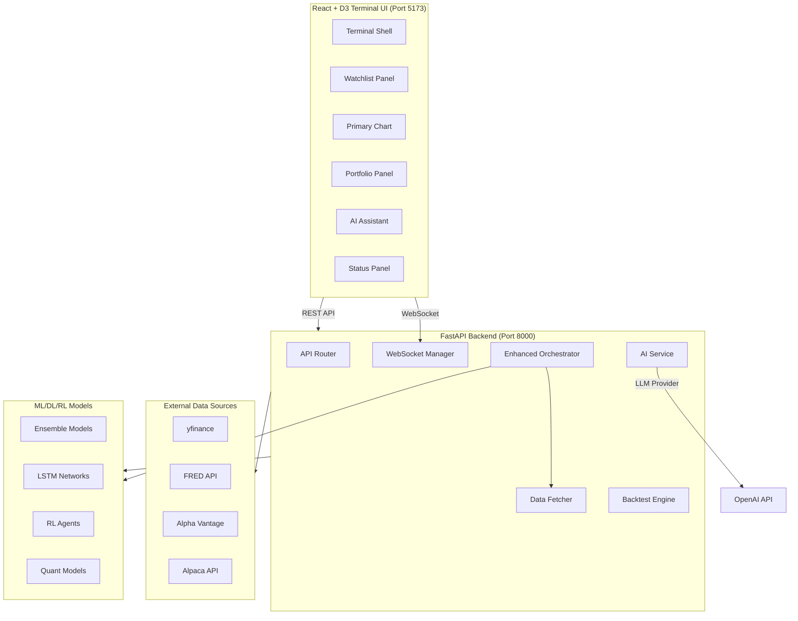

# Bloomberg Terminal Architecture

## System Overview



## Data Flow

### Real-Time Price Updates
```
yfinance → DataFetcher → WebSocket Manager → React Hook → D3 Chart Update
```

### Trading Signal Generation
```
Orchestrator → ML Models → Signal Generation → WebSocket Stream → UI Signal Panel
```

### AI Analysis Request
```
User Input → React → /api/v1/ai/chat → AI Service → LLM Provider → Response → UI
```

### Backtest Execution
```
User Config → React → /api/v1/backtest/run → Backtest Engine → Results → D3 Charts
```

## Component Hierarchy

```
TerminalShell
├── Header
│   ├── GlobalSearch
│   ├── StatusIndicator
│   └── AlertCenter
├── Left Sidebar
│   ├── MarketOverview (Watchlist)
│   └── OrchestratorStatus
├── Main Content
│   ├── PrimaryInstrument (Chart)
│   ├── TradingSignalsPanel
│   └── PortfolioPanel
└── Right Sidebar
    ├── AiAssistantPanel
    └── InsightsPanel
```

## API Endpoint Map

### Market Data
- `GET /api/v1/market/data/{symbol}` - OHLCV candles
- `GET /api/v1/market/heatmap` - Sector/asset performance
- `WS /api/v1/ws/prices/{symbol}` - Real-time price stream

### Trading & Orchestration
- `GET /api/v1/orchestrator/status` - Orchestrator state
- `GET /api/v1/orchestrator/signals` - Latest signals
- `WS /api/v1/ws/live` - General live feed
- `POST /api/v1/orchestrator/run-cycle` - Trigger cycle

### Analysis & AI
- `GET /api/v1/ai/stock-analysis/{symbol}` - AI analysis
- `POST /api/v1/ai/chat` - Conversational AI
- `GET /api/v1/company/analyze/{ticker}` - Full company analysis

### Backtesting & Portfolio
- `POST /api/v1/backtest/run` - Run backtest
- `GET /api/v1/portfolio/equity-curve` - Portfolio performance
- `GET /api/v1/paper-trading/portfolio` - Paper trading positions

### Monitoring
- `GET /api/v1/monitoring/system` - System metrics
- `GET /api/v1/monitoring/alerts` - Recent alerts
- `WS /api/v1/ws/alerts` - Real-time alerts

## State Management Strategy

### Local State (React useState)
- UI state (panel collapse, selected symbol)
- Form inputs
- Temporary selections

### WebSocket State (Custom Hooks)
- Real-time prices
- Live signals
- Alert notifications

### Server State (React Query / SWR - Optional)
- Market data (cacheable)
- Backtest results
- Company analysis (cacheable)

### Persistence (localStorage)
- Watchlist preferences
- UI layout preferences
- Search history

## Performance Considerations

### Frontend
- **Chart Rendering**: Use D3's `d3.bisector` for efficient lookups
- **Data Downsampling**: Reduce data points for long timeframes
- **Virtual Scrolling**: For long watchlists
- **Debouncing**: Throttle WebSocket updates (max 10 updates/sec per symbol)

### Backend
- **Caching**: Cache market data (TTL: 1 minute for prices, 1 hour for historical)
- **Connection Pooling**: Reuse yfinance connections
- **Async Processing**: Background tasks for expensive operations
- **Rate Limiting**: Prevent API abuse

## Security Considerations

- **CORS**: Configured for localhost (expand for production)
- **API Keys**: Stored in `.env`, never exposed to frontend
- **WebSocket**: Validate symbol subscriptions
- **Input Validation**: Sanitize all user inputs

## Deployment Architecture

### Development
```
Frontend (Vite dev server) → Proxy → Backend (uvicorn)
```

### Production
```
Nginx → Frontend (static build) + Backend (uvicorn/gunicorn)
```

### Docker (Optional)
```
docker-compose.yml
├── backend (FastAPI)
├── frontend (nginx + static files)
└── redis (optional, for WebSocket scaling)
```

## Monitoring & Observability

### Metrics to Track
- API response times
- WebSocket connection count
- Chart render performance
- Error rates
- Data fetch success rate

### Logging
- Backend: Structured logging (JSON format)
- Frontend: Console logging (dev), error tracking (production)

## Future Enhancements

1. **Multi-User Support**: Add authentication, user-specific watchlists
2. **Mobile App**: React Native wrapper for mobile access
3. **Plugin System**: Allow custom indicators/strategies
4. **Historical Data Storage**: Local database for faster access
5. **Advanced Order Management**: Full trading interface (if using live broker)
